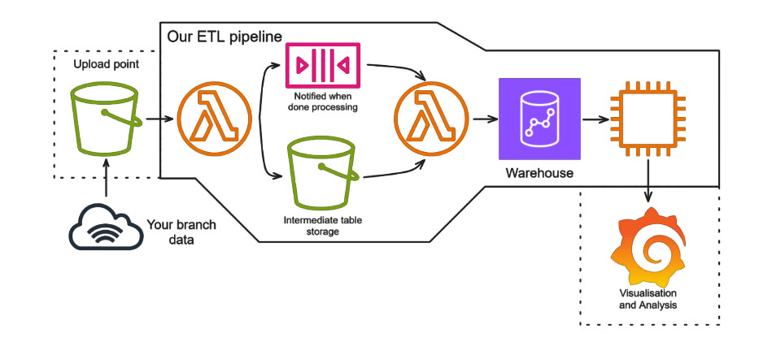

# CoffeETL
CoffeETL's data engineering bootcamp final project repo, including project sprint boards and issues.

# Architecture

Our ETL pipeline runs on the AWS cloud, using CloudFormation (IaC) templates and an
accompanying deploy script.

The pipeline uses two CloudFormation stacks:
1. The deployment stack, which includes a bucket and policy that are used to
store the code, etc. for the ETL stack deployment.
1. The ETL stack, which includes the rest of the pipeline resources:
   - 2 Lambda functions
      - Extract + Transform
      - Load
   - 2 S3 buckets
      - Raw data, (to which clients should upload their raw data)
      - Transformed data, (an intermediate bucket used by the Load lambda)
   - 1 EC2 instance
      - Hosts a Grafana container accessible by the client for data visualisation
   - Other accompanying metadata, (e.g. SecurityGroups, LaunchTemplates, etc.)

Broadly speaking, the pipeline extracts raw data from `.csv` files, cleans and
normalises that data, then loads it into a Redshift database.

# Pipeline Architecture Diagram



## Breakdown
### Extract
The whole pipeline is triggered when a `.csv` file is uploaded to the raw data
bucket. Other input file types are not supported.

### Transform
The pipeline transforms the data in a few steps, as follows:
1. The data is cleaned of sensitive data and PPI,
1. The data is normalised to 1NF, then 2NF, then 3NF.
1. The data is deduplicated
   - Duplication may arise from the 1NF step, which is corrected here.
1. The final data is uploaded to the transformed data bucket for database
loading.

Each step of this process is in its own function, so it is easily possible to
reorder them if required.

### Load
After data is uploaded to the transformed data bucket, a second Lambda is
invoked, which loads the transformed data into a redshift database using the
`COPY` command.

### Visualisations
Data loaded into the Redshift database can be visualised via the Grafana
container running on the EC2 instance deployed as part of the CloudFormation
stack.

Clients may use credentials given by the deployers to access visualisations
we define in `./data_visualisation`

# Deploying the project

## Preparation

The deploy script uses an `aws sso` profile, so make sure you have a profile
that you can specify,
e.g. `aws sts get-caller-identity --profile [profile name]`.

The Load Lambda attempts to pull Redshift credentials from a SSM Parameter
specified by the environment variable `SSM_PARAMETER_NAME`, and will fail
if this is not accessible.
<!--TODO: this might want to be refactored so a potential client wouldn't need
to edit the templates directly.-->

## Deployment scripts

All scripts in the `./cloudformation` folder assume you are running them on
Windows in Git Bash, from that folder. Some attempt has been made to broaden
compatibility, but behaviour is largely untested. (The scripts will exit early
if `$OSTYPE` isn't `msys` and doesn't begin with `darwin`.)

Run the deploy script in the cloudformation folder, using Git Bash:

```bash
cd cloudformation
./deploy.sh <aws-profile>
```

This should deploy 2 stacks including the lambda function responding to a file
upload event on a raw data S3 bucket, and an EC2 instance that runs grafana.

If the stack templates are modified but you don't wish to destroy and redeploy
the entire stack, there is an included update script:

```bash
cd cloudformation
./update.sh <aws-profile>
```

There is also an included delete-stacks script if that is needed, but be aware
that as this destroys all resources, any data not in the Redshift database will
be lost, including Grafana configurations and users.

```bash
cd cloudformation
./delete-stacks.sh <aws-profile>
```
